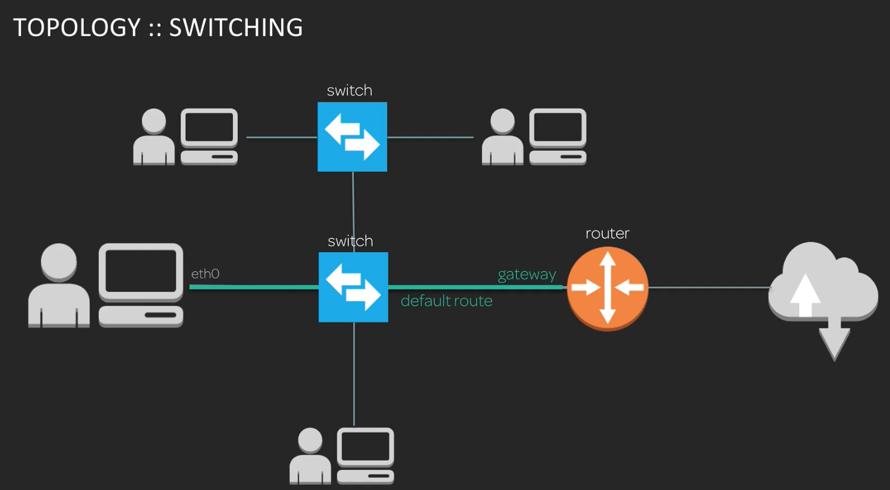
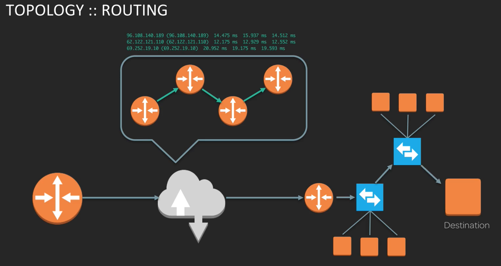
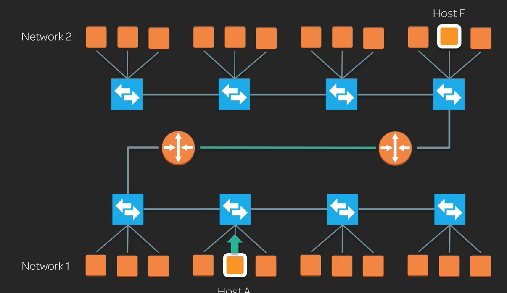

# 1.0 - Basic Network Topology

In this note, we'll very simply cover a few basics of network topology. This is a very broad overview; we'll go into detail in future notes.

## A Basic Local Network

Consider a simple network. This network consists of a few basic parts:
* **A client computer** - The starting point of any request
* **A network connection** - To do any networking, your client needs to be connected to the network. Let's say the connection is an ethernet connection called `eth0`
* **A switch** - This is a network device used for directing *local* area network traffic. It let's you communicate with other devices in your *local* network.
* **A router** - The switch is then conencted to a router, which is itself connected to the upstream internet. This router is the **gateway** to networks *outside* the local network.

For any request to make it outside the local network, it must travel from the client, through the switch, to the router. This is called the **default route**.

We don't need to traverse the router to communicate to other devices in our local network, only to devices outside it.

## Routing

Once a request has hit the internet via your router, it will probably need to traverse a number of additional routers and networks before it hits its final destination.

Eventually, it will hit the edge of its destination network, and can traverse that local network until its reached its final destination, where it can request the data.

## Recap

* **Switches** facilitate *local* network traffic
* **Routers** facilitate traffic *between networks*

The diagram below shows two simple networks whose routers are connected to each other. In principle, there could be the internet between those two routers, or they might represent two private networks that are connected (e.g. an office network and a server network).

For Host A to communicate to Host F, it will create a network message, that contains information including:

* The **network request** or the payload
* The **destination address** of Host F
* The **return address** for Host A
* The **address of its own network card**
* The **address of its default gateway** because Host F is outside Network 1

We'll go over all this in more depth in future lectures.

## A Cloud Server

Cloud architecture is a little different. A request will hit the edge of the target network, where it'll be directed to the VPC, where it passes through a number of public access control lists before reaching the final destination. Cloud architecture abstracts a lot of the routing into **software-defined networking**, which is a simulation of a traditional network. An advantage of this approach is that it allows very granular security control.